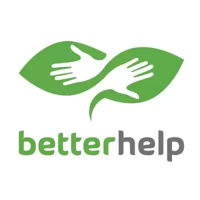
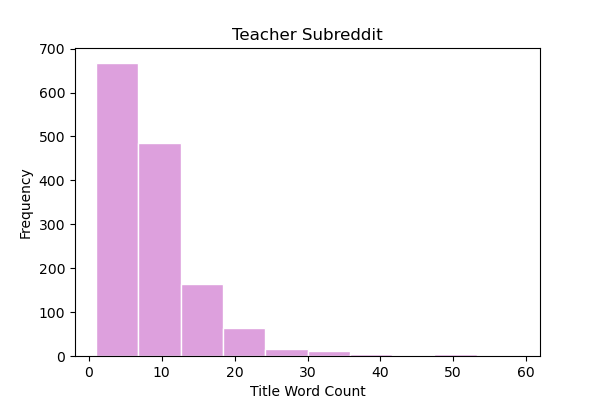
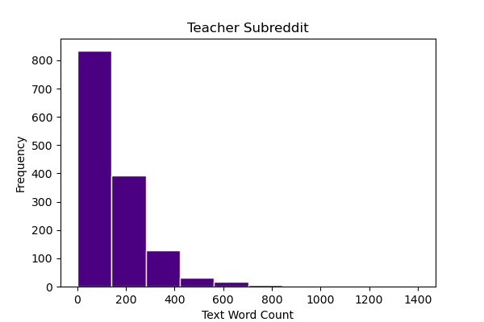
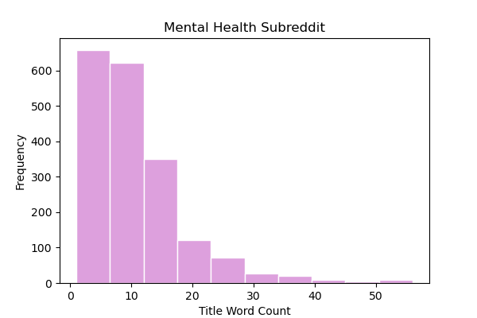
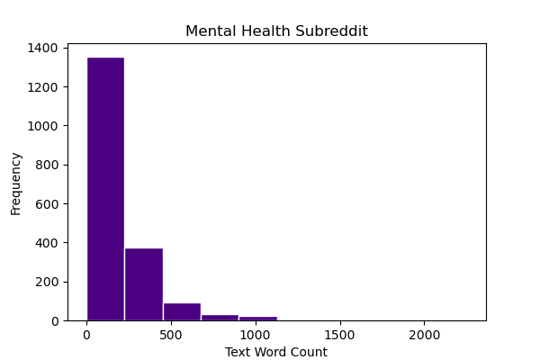
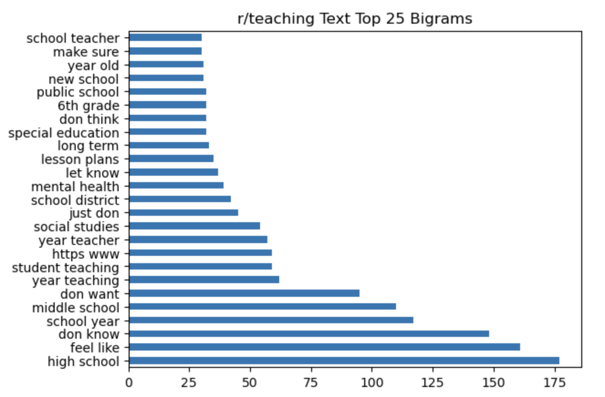
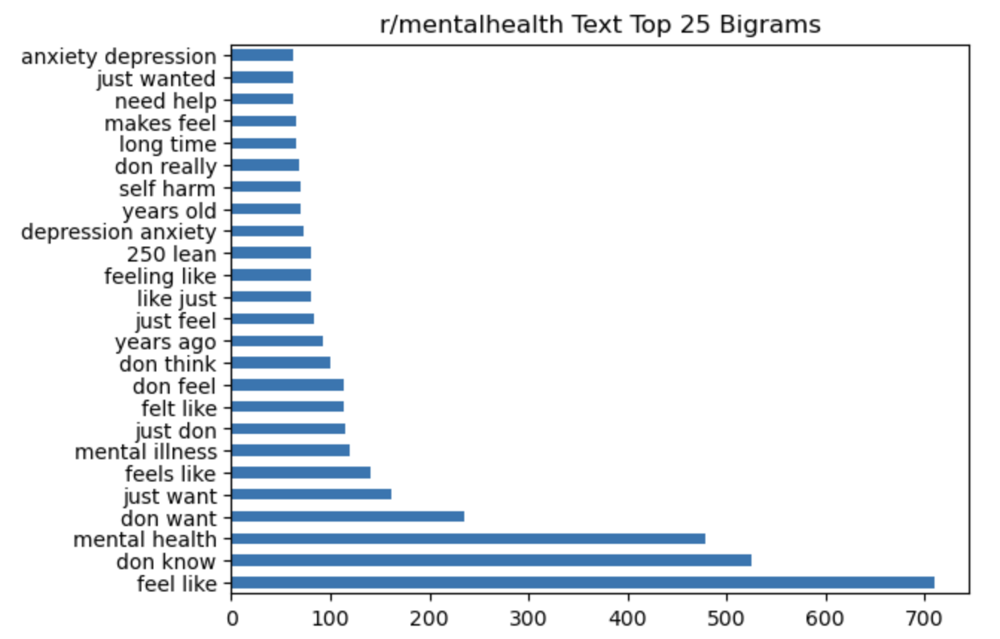
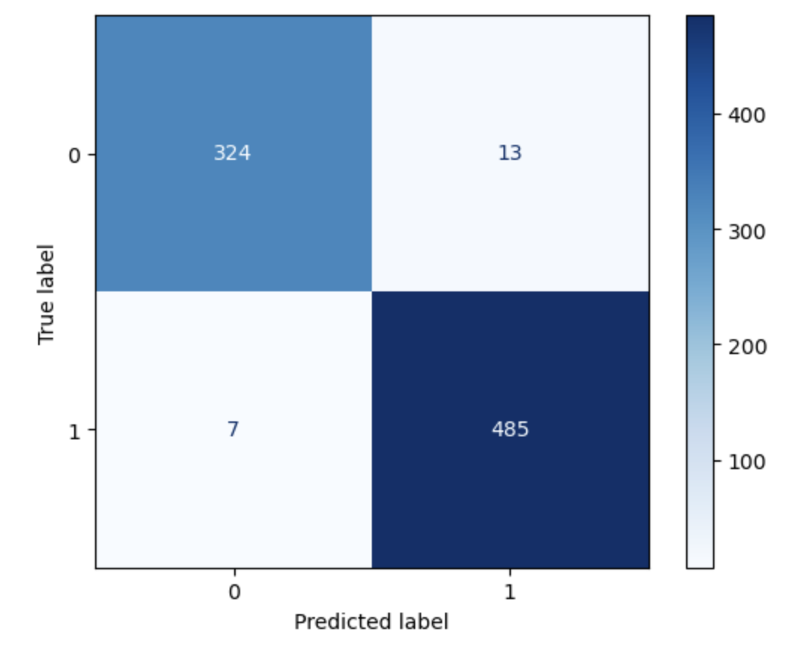

# Project 3 - Web APIs & NLP




Teaching is a fulfilling, yet taxing career. I personally can attest to this, as I was once a high school math teacher. With long hours and a heavy workload, it is not difficult to fall victim to "teacher burnout". _[Psychology Today](https://www.psychologytoday.com/intl/blog/high-octane-women/201311/the-tell-tale-signs-of-burnout-do-you-have-them)_ describes burnout as "a state of chronic stress that leads to physical and emotional exhaustion, cynicism, detachment, and feelings of ineffectiveness and lack of accomplishment." Without having the proper support, teachers are in danger of being overworked and not taking care of their own mental and physical health needs. That is why **[Better Help](https://www.betterhelp.com/)** is stepping in to support. _Better Help_ is an online counseling platform with a mission of "Making professional therapy accessible, affordable, and convenient". The team at _Better Health_ is creating the  **Educator Alliance Initiative** which will supply their counseling to educators for free in hopes to help reduce the overall teacher burnout rate in the education system. Once this initiative goes live, the organization is expecting a mass influx in inquires. Those in the inquiry intake department will need to be able to quickly and effectively determine if that person is a candidate for the Educator Alliance Initiative. _Better Help_ has enlisted my assistance in building a model that will be able to read any incoming inquery and predict whether or not to place that person into their new initiative with at least 90% accuracy. 


# File Directory

```
project-2
|__ code
|   |__ 01 - Redit-praw
|     |__mentalhealth.ipynb
|     |__teaching.ipynb
|   |__ 02 - Cleaning.ipynb   
|   |__ 03 - EDA.ipynb
|   |__ 04 - Modeling.ipynb     
|__ data
|   |__ cleaned_mentalhealth_posts.csv
|   |__ cleaned_teaching_posts.csv
|   |__ combo.csv
|   |__ mentalhealth_posts.csv
|   |__ teaching_posts.csv
|__ images
|   |__ BetterHelp_logo.jpg.webp
|   |__ Mentalhealt_Text_Word_Count.png
|   |__ Mentalhealt_Title_Word_Count.png
|   |__ Mentalhealth_Text_Bigram.png
|   |__ Mentalhealth_Text_Sentiment.png
|   |__ Model_Confusing_Matrix.png
|   |__ Teacher_Text_Word_Count.png
|   |__ Teacher_Title_Word_Count.png
|   |__ Teaching_Text_Bigram.png
|   |__ Teaching_Text_Sentiment.png
|__ Project 3 - Kiersten Johns.pdf
|__ README.md
```


# Outside Research

When it comes to a person's mental well being, proper support is necessary. Unfortunately, educators are a mass population of people who are typically not provided with the proper support. With the rise of Covid 19 in early 2020, there was a spotlight placed on the fact that the majority of school districts in the US do not supply any form of insurance to their educators. This is again a fact that I can attest to personally; every school that I have worked for has not supplied insurance to any of their staff members. According to Sterling Price, I am in good company. [Sterling Price](https://www.valuepenguin.com/teacher-benefit-study#rate), the senior research analyst at ValuePenguin, notes a key finding that nearly half a million teachers in our country are uninsured. This leaves educational professionals to pay for health services (mental or physical) out of their own pocket, on a already minimal salary. [Mira](https://www.talktomira.com/post/how-much-does-therapy-cost-without-health-insurance-in-2021), a modern benefits provider, states that in 2023 "on average, a therapy session costs between \\$138 - \\$300 for an hour-long session for those who do not have health insurance." Therefore, a session per week could end up costing an educator $1200/month. This is an expense that most educators simply cannot afford, and hence deters them from seeking professional mental health help. 


Bellow are some teacher burnout statistics (provided by [ThinkImpact](https://www.thinkimpact.com/teacher-burnout-statistics/#:~:text=New%20teachers%20are%20leaving%20their,in%20other%20countries%20are%20quitting.)) that I found intriguing and alarming: 

- A survey showed that 51% of teachers fear for their mental and physical health when teaching.

- 90% of teachers reported that their feelings of burnout were a serious problem for them and their job.

- Between February 2020 – May 2022, it was estimated that over 300.000 public school teachers and other staff quit due to burnout.

- Up to 30% of new teachers are quitting their job within 5 years of teaching.

- The amount of teachers quitting or retiring has risen by 55% in the last 30 years.

- New teachers are leaving their jobs within 5 years of teaching in percentages as high as 30%.

- 8% of US teachers are quitting their careers, while only 3% to 4% of teachers in other countries are quitting.

- 86% of teachers reported seeing far more teachers quit and retire since 2020 than they had ever seen before.


# Data Dictionary

|Name|Dataset|Description|
|---|---|---|
|**mentalhealth**|mentalhealth_post.csv| 3991 posts pulled from Reddit's "mentalhealth" subreddit.
|**teaching**|teaching_post.csv| 3463 posts pulled from Reddit's "teaching" subreddit.
|**cleaned_mentalhealth** | cleaned_mentalhealth_posts.csv | Removed nulls from mentalhealth dataset
|**cleaned_teaching** | cleaned_teaching_posts.csv | Removed nulls from teaching dataset
|**combo** | combo.csv | Concatonated version of cleaned_mentalhealh and cleaned_teaching


# Executive Summary

Given the need to be able to decipher between an educator inquiring about mental health services and other non-educator customers I turned to sources on each of those topics. The Teaching subreddit [(r/teachihng)](https://www.reddit.com/r/teaching/) is a community meant for educators to share educational news, share tips and trick, and to even vent/seek advice on the trials and tribulations of being a teacher in today's society. This subreddit currently has over 120k members. The Mentalhealth subreddit [(r/mentalhealth)](https://www.reddit.com/r/mentalhealth/) is a forum to discuss, vent, support and share information about mental health, illness and wellness, and is currently hosting 417k members.

From these two subreddits, over 7,400 posts were pulled, which included the titles and the text of each post. To clean these two datasets null and duplicated rows were removed. Attaching a picture or video in the post is what would create the null values and were thereby not helpful for this particular scenario. Once this cleaning was completed the teaching and mental health datasets provided 1,420 and 1,893 viable posts respectively. This is close to a 50/50 split in the combination of these two datasets. 

Through the EDA process the two subreddits were explored separately. The first detail explored was the distribution of length and word counts of the title and post text. The distribution of the word counts only for titles and text can be seen below:

 


 
 


As can be seen in the above images, all four distributions are skewed right meaning that super long titles and texts are not the majority. However you can see that those in the mental health often wrote more words.


From there, curiosity led to the exploration of what those words actually are. The top 25 most common singular words were explored, yet, upon further inspection the top 25 bigrams of each subreddit deemed to provide better insight. Those bigrams are depicted below:





From the image above, it can be seen that the terms "mental health" and "feel like" are top bigrams in both of these subreddits, making them common topics of discussion amongst the members. This sparked interest in the overall mood of these two reddit threads lead to a sentiment analysis. A score of 1 concludes a very positive sentiment, likewise a score of -1 concludes a very negative sentiment. Below is a table of the scores. The mental health scores are clearly negative, however, the teaching scores are not far ahead, meaning the overall sentiment of both of these subreddits is pretty negative. 


|teaching title|teaching text|mentalhealth title|mentalhealth text|
|---|---|---|---|
|0.00915549295774648|0.313248661971831|-0.08286455361859482|-0.029222345483359734|


After completion of EDA, I concatenated the two separate dataframes into one large dataframe. Multiple models were run on the combination dataframe (to include the use of CountVectorizer, TfidfVectorizer, MultinomialNB, and LogRegression) on the separate titles, texts, and then the combination of all that tested multiple parameters. The best score for the tests run on the title only was 0.872, and I knew I could do better. For text only it was 0.967 which is a vast improvement. It seemed to me that the more text that the model had to learn from, the better so I ran these tests on the combination of both the title and the text and received a score of 0.976. With my baseline model providing a score of 0.429, any of these models outperformed it. The best model used TfidfVectorizer as the pre-processor and Multinomial Naive Bayes as the model on the combination data of both the title and the text. 

To break that down a bit further, tfidVectorizer tokenizes, counts, and normalizes the data to help streamline the natural language processing. The Naive Bayes models are commonly used for classification problems because they are fast and they often outperform more complicated models. The Multinomial NB was used because the data had positive integers. The best parameters of this model included an n_gram range of (1,2), meaning that the best model was built off of unigrams and bigrams. I personally found this to be interesting due to my previous statement in which I mentioned that I felt the bigrams were more insightful. This model also removed all english stopwords. 

This model provided a training score of 0.9762 and a testing score of 0.9759 which can be interpreted as the mean accuracy of this model equaling 97.59%. Not too shabby! What does the 2.41% inaccuracy look like? Further examination of the predicted test values resulted in the following confusion matrix:



In this matrix, it can be see that out of the 829 predictions made on the testing dataset, only 20 were incorrect. 13 of those incorrect predictions are "False Positives", meaning that they were predicted to be from r/teaching, when in reality they were from r/mentalhealth. The other 7 incorrect predictions are "False Negatives", which means that they were predicted to come from r/mentalhealth but they actually came from r/teaching. Could these same mistakes be made by humans? Upon further inspection of the wrong predictions, I believe so. Below is an example of an incorrect prediction:
> "Giving up. I quit my position and I don't know what's next. The pressure of this job is tolerable, if I was working towards something. As it is now, I feel like I am joining a game of Monopoly 20 turns after everyone else. Just roll the dice and pay rent, that's my only option. I just want to stop. I want to say it's a mental health crisis, but the reality is, my poor mental health comes from social and financial poverty. I love Teaching. I love the job, really. But it's hard to keep rolling the dice, knowing I can't buy shit. I just work and work and pay for other people's shit. The only rent free spot on the board is jail. I've been thinking about how I could save for retirement and my conclusion is I will not be able to retire. No matter how much personal wealth I accumulate, without a house I will be relying on the generosity of others when I am too old to work. There is not future in this and I hat being told to roll the dice by people who own everything on the board. Just roll the dice, that's how you win! They say unsarcasticly. I want to give up. So I gave up. Now I am depressed."

This example was predicted to come from r/mentalhealth when in actuality it came from r/teaching. Key words and phrases such as "giving up", "mental health criss", "my poor mental health", "now I am depressed", could easily be interpreted to come from a mental health forum, even by a quick glance from a human. Due to this, the 2.41% inaccuracy is acceptable and the model is successful. 


### Conclusion:

In summary, _Better Help_ will be able to use the winning model to sort incoming customers into two categories, those who are eligible for the Educator Alliance Initiative and those who are not. The model will perform with 97.59% accuracy. The 2.41% inaccuracy will derive two scenarios:

- False Positives: predicted to be from r/teaching, when in reality they were from r/mentalhealth. In this case, a customer would be placed into the initiative when they should not be. Conflict could arise if this customer is started in the program for free health care and then removed. To resolve this issue, all those who are identified as eligible should submit teaching credentials and documents for processing. 

- False Negatives: predicted to come from r/mentalhealth but they actually came from r/teaching. In this case, the customer should be included in the initiative and is not. A simple submission of credentials and documents could resolve this issue and allow the customer to proceed with the program. 

With the assistance of _Better Help_'s Educator Alliance Initiative, education professionals around the nation can start receiving the support they need to help them continue building a better tomorrow for us all. 


# Sources

- [Psychology Today](https://www.psychologytoday.com/intl/blog/high-octane-women/201311/the-tell-tale-signs-of-burnout-do-you-have-them)

- [Better Help](https://www.betterhelp.com/)

- [ValuePenguin](https://www.valuepenguin.com/teacher-benefit-study#rate)

- [Mira](https://www.talktomira.com/post/how-much-does-therapy-cost-without-health-insurance-in-2021)

- [ThinkImpact](https://www.thinkimpact.com/teacher-burnout-statistics/#:~:text=New%20teachers%20are%20leaving%20their,in%20other%20countries%20are%20quitting.)
 
- [Teaching Subreddit](https://www.reddit.com/r/teaching/)

- [Mental Health Subreddit](https://www.reddit.com/r/mentalhealth/)

-[General Assembly Notes & Lessons](https://generalassemb.ly/)